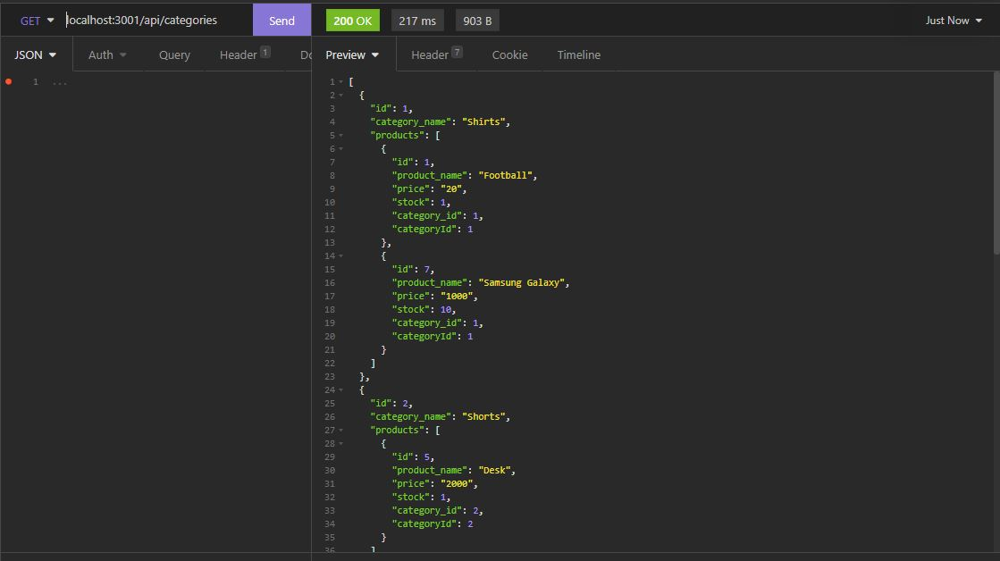
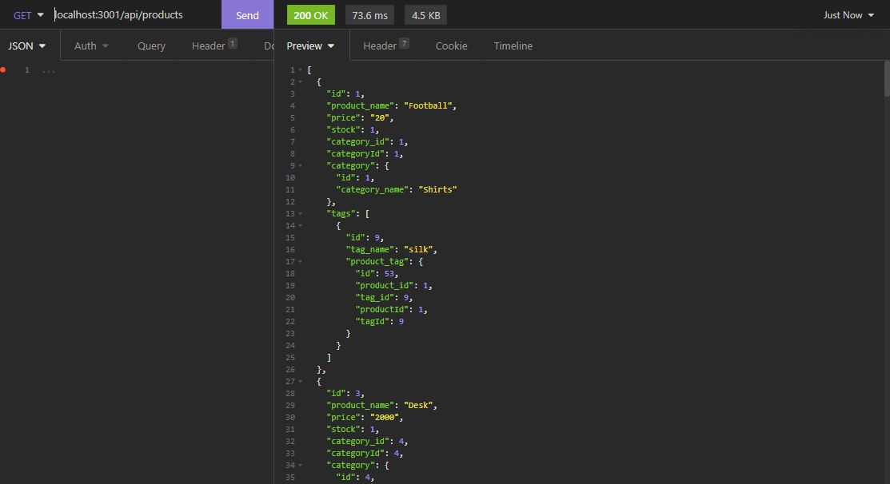
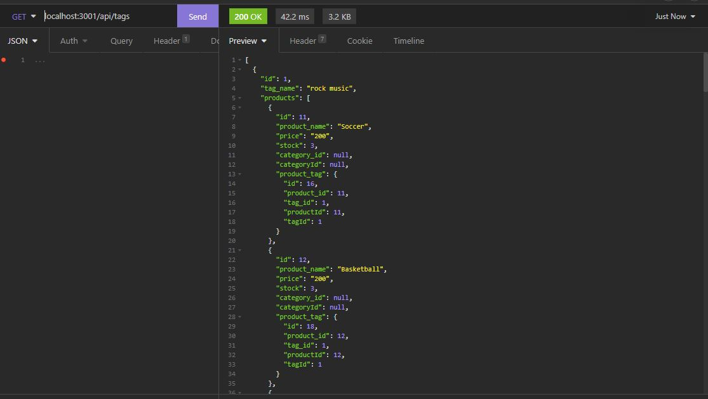

# ecommerce-back-end

Ecommerce Back End is a website that allows a user to view/update/delete/create data for categories, products that are associated with each category, and product tags
that are associated with each product tags.

This program was created using Javascript, Sequelize to access the MySQL database, and Express.js to listen to different routes for posting/deleting/updating/fetching data for
categories, products, and product tags.

# Demo of Project

The following video demos functionality on how to run the ecommerce-backend program.

# Screenshots

The following demonstrate GET route functionality for Categories, Products, and Product Tags

